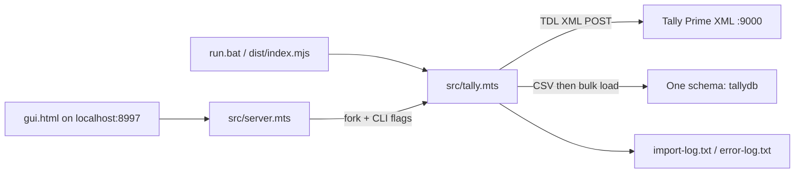
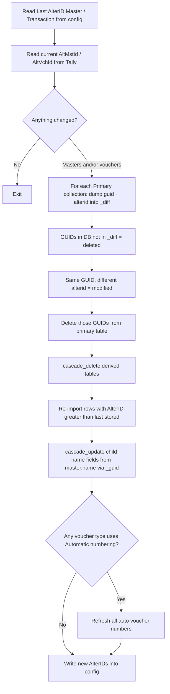
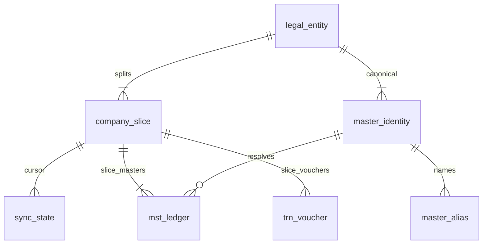

# Productization Plan: Multi-Company Warehouse with Incremental Sync

This document is the product and engineering specification extracted from the current `tally-database-loader` codebase. It covers:

1. How the utility works today, with emphasis on **incremental upload**.
2. How to **repackage** it as a product with a real UI, instead of a config-file utility.
3. How to store **multiple split Tally companies in one database**, across different financial-year time frames.
4. How to keep reports correct when **master names change** (ledgers, stock items, groups, godowns, and so on).

The current code is a local Windows utility that talks to Tally Prime over XML and dumps tabular data into SQL Server / MySQL / PostgreSQL / BigQuery / CSV. It is not a multi-tenant warehouse, and it is not a product UI. The design below keeps the existing Tally extraction engine and rebuilds identity, storage, and presentation around it.

---

## 1. What this repo is today

### 1.1 Runtime shape



Important facts:

- One process, one `config.json`, one target schema, one Tally company name.
- The GUI is a Bootstrap form that edits `config.json` and streams log lines over WebSocket `:8998`.
- Multi-company today means **one database per company**, driven by `platform/powershell/sync-multiple-company.ps1`.
- Multi-year inside a *single* Tally company is a hidden CLI trick: first year full load, later years `--tally-master false --tally-truncate false`. That is not the same as Tally **Split Company**.

### 1.2 Data model today

Tally is hierarchical. The loader flattens it into:

| Kind | Prefix | Identity |
| --- | --- | --- |
| Master | `mst_*` | `guid` primary key |
| Transaction header | `trn_voucher` | `guid` primary key |
| Transaction lines | `trn_accounting`, `trn_inventory`, … | no own PK; linked by voucher `guid` |

Relationships used by reports are **name-based**, not GUID-based:

```
mst_ledger.name  -->  trn_accounting.ledger
mst_stock_item.name  -->  trn_inventory.item
mst_group.name  -->  mst_ledger.parent
```

That is why renaming a ledger in Tally is a first-class incremental problem: every child row still stores the old name unless it is rewritten.

### 1.3 Two export definitions

| File | Method | Sync modes |
| --- | --- | --- |
| `tally-export-config.yaml` | Report-based TDL | Full |
| `tally-export-config.json` | Collection-based (faster, less RAM) | Full only |
| `tally-export-config-incremental.yaml` | Report-based + `alterid`, `_guid` FKs, cascade rules | Incremental |

Incremental sync **refuses JSON definitions**. Collection-based extraction is the better engine; it is not wired to incremental yet.

---

## 2. Incremental data upload (current implementation)

This is the highest-value existing feature and the hardest one to reuse for split companies without changing identity.

### 2.1 Why it exists

A full sync truncates every table and reloads masters + vouchers for the selected period. On large companies that is slow and RAM-heavy in Tally. Incremental pulls only rows whose Tally `AlterID` is newer than the last successful sync.

### 2.2 Prerequisites

From `docs/incremental-sync.md` and `src/tally.mts`:

1. Recreate the database from `database-structure-incremental.sql` (not the full-sync script).
2. `config.json`:
   - `sync: incremental`
   - `definition: tally-export-config-incremental.yaml`
   - `company` **must** be a real company name (blank = active company, unsafe)
   - `frequency` > 0 to poll Tally every *n* minutes
3. First run is still a full extract of whatever Tally currently holds. Incremental only helps on later runs.
4. Supported targets: SQL Server, MySQL, PostgreSQL. Not BigQuery (UPDATE cost) and not CSV.

### 2.3 Extra columns only present in the incremental schema

Compared with `database-structure.sql`, the incremental schema adds:

- `alterid` on every primary master and on `trn_voucher`
- GUID foreign keys next to every name field: `_parent`, `_ledger`, `_item`, `_godown`, `_uom`, `_voucher_type`, …
- Staging tables: `_diff`, `_delete`, `_vchnumber`
- `config` key/value rows for last AlterIDs

The underscore columns are the **stable identity**. The name columns are the **display copy**, kept in sync by cascade updates.

### 2.4 Algorithm (as implemented)



Concrete SQL (SQL Server flavour, from `src/tally.mts`):

```sql
-- deleted in Tally
insert into _delete
select guid from mst_ledger
where guid not in (select guid from _diff);

-- modified in Tally
insert into _delete
select t.guid from mst_ledger t
join _diff s on s.guid = t.guid
where s.alterid <> t.alterid;

delete from mst_ledger where guid in (select guid from _delete);
delete from trn_accounting where _ledger in (select guid from _delete); -- cascade_delete example

-- after fresh insert of changed masters
update t set t.ledger = s.name
from trn_accounting t
join mst_ledger s on s.guid = t._ledger;
```

The last statement is how **master renames** are handled today: Tally returns the new name on the master row; child tables are rewritten to match.

### 2.5 What incremental does *not* do

These constraints are the reason split-company-in-one-DB cannot be a config tweak:

| Constraint | Effect |
| --- | --- |
| `fromdate` / `todate` forced to `auto` | Whole books, not a FY window |
| Single `config` table, truncated on every save | One company cursor only |
| Deletes are `guid not in _diff` with no company filter | A second company would look like a mass delete of the first |
| Primary keys are `guid` alone | Tally split often **reuses master GUIDs** across the old and new company |
| `opening_balance` lives on `mst_ledger` | Each split year has its own opening; last write wins |
| YAML-only | Cannot use the faster JSON extractor |
| Manual DELETE/TRUNCATE of warehouse tables | Breaks the AlterID cursor |
| Recommended: one FY per incremental company | Matches Tally split practice, but the loader still stores only one company |

Polling (`frequency`) compares in-memory AlterIDs and skips Tally export when nothing moved. Continuous sync also refuses to start if `company` is blank.

### 2.6 Opening allocations: already a split-company artefact

Release 1.0.8 added `mst_opening_bill_allocation` and `mst_opening_batch_allocation` specifically for **pending bills and batches as on the split date**. Bills receivable/payable reports already union those opening rows with `trn_bill`. That is the correct pattern for one split slice. It becomes wrong if two slices share one ledger table without a company key: openings from FY 2024-25 would mix with openings from FY 2025-26.

---

## 3. Productization: repackage as a product UI

### 3.1 Why the current GUI is not a product

`gui.html` is a single 640px form: database credentials, Tally host, one company, one period, Sync / Abort. Gaps:

- No saved list of companies or split timeline.
- No sync history, row counts per table, or last successful cursor.
- Frequency is collected in the form but `prepareConfigObj()` currently reads frequency from the sync-mode dropdown, so GUI-driven polling is broken.
- Passwords land in `config.json` on disk if the user clicks Save.
- Windows-only launcher (`run-gui.bat`, `child_process.exec('start http://...')`).
- The process exits when the browser tab closes.
- Reports live as raw `.sql` files; the UI never runs them.
- No mapping screen for renamed masters.

### 3.2 Product shape that fits Tally

Tally XML is almost always on the accountant's PC. This should stay a **local agent + local web UI**, not a cloud-only SaaS that cannot reach Tally.

Recommended packaging:

| Layer | Role |
| --- | --- |
| **Agent** | Existing Node engine (`tally.mts` / `database.mts`), run as a Windows service or tray app |
| **App UI** | Local web app (desktop shell optional: Tauri/Electron) on `127.0.0.1` |
| **Warehouse** | One PostgreSQL (preferred) or SQL Server database per customer / CA firm, many companies inside it |
| **Optional cloud** | Read replica / BigQuery / MotherDuck for dashboards, fed by the warehouse, never by live Tally |

Do not put Tally credentials or XML in the cloud. Sync always originates on the machine where Tally Prime is licensed.

### 3.3 UI information architecture

```text
Workspace
├── Connections          database + Tally XML endpoint
├── Entities             legal entities (GSTIN / PAN)
│   └── Company slices   each Tally company + books-from/to
│       ├── Sync         full / incremental, schedule, logs
│       └── Masters      identity + rename review
├── Jobs                 queue, last run, errors, Abort
├── Explore              ledgers, vouchers, trial balance
└── Reports              TB, P&amp;L, registers, ageing — filtered by entity and period
```

Primary screens:

1. **Setup wizard** — detect Tally on `:9000`, list open companies, test DB, create warehouse schema.
2. **Company timeline** — a Gantt-style list of slices: `Acme Pvt Ltd (to 31-Mar-2025)` then `Acme Pvt Ltd (from 01-Apr-2025)`. User marks “this is a split of that”.
3. **Sync console** — per-slice progress (masters vs vouchers, table row counts), not a raw log dump as the only view. Keep the log as a drawer.
4. **Master mapping** — unmatched / renamed / merged ledgers and items across slices. This is the product feature that makes multi-year reports possible.
5. **Period explorer** — pick entity + from/to; run the existing SQL reports against GUID-joined views.

Visual direction: drop Bootstrap 5 form chrome. Use a dense operations UI (sidebar + table + inspector). Shadcn/Radix + a simple local API is enough; the value is the domain model, not a marketing landing page.

### 3.4 Agent API (replace ad-hoc HTTP in `server.mts`)

Keep the engine, replace the protocol:

| Method | Purpose |
| --- | --- |
| `GET /tally/status` | Prime running? version? |
| `GET /tally/companies` | Open companies, books-from, AlterIDs |
| `POST /slices` | Register a Tally company as a warehouse slice |
| `POST /slices/:id/sync` | Full or incremental, scoped to that slice |
| `POST /slices/:id/abort` | Kill the child process |
| `GET /jobs/:id` | Status + log cursor |
| `GET /entities/:id/masters?unmapped=1` | Mapping work queue |
| `POST /masters/map` | Manual GUID / name links |

Config should move from a single `config.json` to:

- encrypted connection secret store
- `company_slice` + `sync_state` tables in the warehouse

CLI flags stay for unattended Task Scheduler jobs.

---

## 4. Multiple split companies in one database

### 4.1 Tally split, in warehouse terms

When books are split on (say) 01-Apr-2025:

| Slice | Typical Tally name | Contents |
| --- | --- | --- |
| Historical | `Acme Pvt Ltd` or `Acme Pvt Ltd FY 2024-25` | Vouchers up to 31-Mar-2025, masters as they stood in that company |
| Current | `Acme Pvt Ltd from 01-Apr-2025` | Opening balances + bills/batches as on split date, vouchers from 01-Apr-2025 |

Facts that break the current schema:

1. **Master GUIDs are often copied** into the new company. `guid` is unique *inside* a Tally company, not across split companies. A single-column PK collides.
2. **Voucher GUIDs are new** in the new company. Transaction tables can coexist if prefixed by company, but masters cannot.
3. **Names drift independently** after the split. “Cash” in FY24 may be “Cash in Hand” in FY25, same GUID or not.
4. **Opening balances are per slice.** Loading the new company over the old `mst_ledger` row overwrites FY24 opening with FY25 opening.
5. **AlterID is per Tally company.** Incremental cursors cannot be shared.
6. Company **names themselves change** (`… FY 2024-25` vs `… from 01-Apr-2025`). The loader already keys off `tally.company` string equality.

### 4.2 Target identity model



**`legal_entity`** — the business the CA actually reports on (GSTIN / PAN / group name).

**`company_slice`** — one open Tally company, one books interval, one incremental cursor.

**`master_identity`** — one row per real-world ledger/item/group across slices.

**`master_alias`** — every name/alias seen, with the slice and time it was observed.

All existing `mst_*` / `trn_*` tables gain `slice_id`. Primary keys become `(slice_id, guid)` for tables that currently use `guid`. Line tables become `(slice_id, guid, …)`. Every incremental DELETE/UPDATE is `WHERE slice_id = ?`.

### 4.3 Proposed core tables

See `docs/proposed-schema-multi-company.sql` for a PostgreSQL sketch. The minimum additive set:

```text
legal_entity (id, name, gstn, pan, canonical_name)
company_slice (
  id, entity_id,
  tally_guid, tally_name,
  books_from, books_to,
  parent_slice_id,          -- previous FY / split source
  sync_mode                 -- full | incremental
)
sync_state (
  slice_id,
  last_alterid_master,
  last_alterid_transaction,
  last_sync_at,
  last_status
)
master_identity (
  id, entity_id,
  master_type,              -- ledger | group | stock_item | godown | ...
  stable_guid,              -- Tally GUID when it is the same across splits
  canonical_name,
  match_method              -- guid | gstn | alias | manual | unmatched
)
master_alias (
  identity_id, slice_id, name, alias, observed_at
)
```

Then, for example:

```text
mst_ledger  PK (slice_id, guid)
            identity_id nullable FK  -- filled by matcher
            name, _parent, opening_balance, ...   -- slice-local

trn_accounting  (slice_id, guid, _ledger, amount, ...)
```

Reports **must** join `trn_accounting._ledger` → `mst_ledger.guid` **and** `slice_id`, then optionally fold to `master_identity` for cross-year names. Stop joining on `ledger` name for warehouse queries.

### 4.4 How a split year is ingested

1. User registers slice A: Tally company `Acme Pvt Ltd`, period auto or to 31-Mar-2025. Full sync into `slice_id=A`.
2. User registers slice B: Tally company `Acme Pvt Ltd from 01-Apr-2025`, marks parent = A. Full sync into `slice_id=B`.
3. Matcher runs:
   - Same Tally GUID + same master type → same `master_identity` (usual split case).
   - Else GSTIN / PAN / bank account for ledgers; HSN + part number for items; case-folded alias.
   - Remainder goes to the mapping UI.
4. Incremental thereafter is **per slice**. Only the open current-year company is typically polled. Historical slices are frozen unless the user re-opens that Tally company.

Do not use `--tally-truncate false` across two Tally companies. That flag is only for multiple years **inside one company file**.

### 4.5 Period rules

- Store `books_from` / `books_to` on the slice from Tally (`BooksFrom`, last voucher date).
- Reject overlapping voucher dates for two slices of the same entity unless the user explicitly allows it (rare: partial recast).
- Cross-year P&amp;L / trial balance:
  - Use opening balances **only from the earliest slice**.
  - Use `mst_opening_bill_allocation` / `mst_opening_batch_allocation` **only from the slice that owns that opening** (usually the later split).
  - Sum `trn_*` across slices in range, joined through `master_identity`.
- Incremental remains `fromdate=auto` **inside that Tally company**. The warehouse period filter is applied at query time, not at Tally export time.

### 4.6 Incremental engine changes required

All of these are in `src/tally.mts` / `src/database.mts`:

1. Stop truncating `config`. Use `sync_state` keyed by `slice_id`.
2. Stamp every extracted row with `slice_id` before bulk load (CSV extra column, or `ALTER TABLE` default + session setting).
3. Scope `_diff` / `_delete` comparisons: `guid not in _diff` **and** `slice_id = current`.
4. Scope cascade_update / cascade_delete with `slice_id`.
5. Do not treat a reused master GUID from another slice as a collision; PK includes `slice_id`.
6. Keep `_diff` / `_delete` / `_vchnumber` global staging tables but always truncated and filled for one slice at a time (single-writer queue).
7. After master import, run the identity matcher for that slice only.

Until those exist, loading a second company into the same schema will either unique-key-fail or silently delete the first company’s rows.

---

## 5. Master names that have changed

Tally stores the **current** master name on vouchers. It does not keep a historical name on each voucher. The incremental YAML already encodes that fact as `cascade_update`.

### 5.1 What happens today (single company)

1. User renames ledger `Cash` → `Cash in Hand` in Tally.
2. Master `AlterID` increases; voucher AlterIDs may not.
3. Incremental re-imports the ledger row (new `name`, same `guid`).
4. `cascade_update` rewrites `trn_accounting.ledger`, `trn_bill.ledger`, and the rest to `Cash in Hand`.
5. Reports that join on name keep working **inside that company**.

This does **not** work across split companies:

- Slice A still has name `Cash` on its frozen rows (until someone incremental-syncs A, which they usually cannot, because that Tally file is archived).
- Slice B has `Cash in Hand`.
- `UNION ALL` of `trn_accounting` grouped by `ledger` splits one account into two.

### 5.2 Resolution policy

| Signal | Confidence | Action |
| --- | --- | --- |
| Same Tally GUID in parent and child slice | High | Auto-link `master_identity` |
| Same GSTIN / PAN / bank account, different GUID | High for parties | Auto-link, flag for review |
| Exact alias match (`mst_ledger.alias`) | Medium | Auto-link if unique |
| Normalized name (trim, case, punctuation) | Low | Suggest, do not auto-link |
| User maps in UI | Authoritative | Always wins |

Store **canonical_name** on `master_identity` (editable). Keep slice-local `name` untouched so a re-sync from Tally cannot clobber the canonical label.

Reporting views:

```sql
create view v_accounting as
select
  s.entity_id,
  v.date,
  coalesce(i.canonical_name, l.name) as ledger,
  a.amount,
  v.is_order_voucher,
  v.is_inventory_voucher
from trn_accounting a
join trn_voucher v
  on v.slice_id = a.slice_id and v.guid = a.guid
join company_slice s
  on s.id = a.slice_id
join mst_ledger l
  on l.slice_id = a.slice_id and l.guid = a._ledger
left join master_identity i
  on i.id = l.identity_id;
```

Group-by for a 3-year P&amp;L uses `ledger` from this view, not the raw Tally name.

### 5.3 Groups, UOM, godowns, voucher types

The same rename problem exists for every name-typed foreign key. Incremental YAML already lists them under `cascade_update` (`mst_group.parent`, `mst_stock_item.uom`, `trn_voucher.voucher_type`, …). The warehouse matcher needs one `master_type` per collection, not only ledgers.

### 5.4 What not to do

- Do not overwrite historical slice names during a current-year sync.
- Do not join reports on `name` once two slices exist.
- Do not delete a master in slice B because it is absent in slice A’s `_diff`.
- Do not assume GUID equality when a company was **recreated** instead of Split (GUIDs will be new; mapping UI is mandatory).

---

## 6. Packaging and delivery

### 6.1 Keep

- TDL generation from YAML (and later, JSON incremental).
- GUID extraction (`$Guid:Collection:$Name` expressions already in the incremental YAML).
- Bulk load paths (`insert` vs `file`).
- Report SQL as the analytics contract — rewrite them onto views, do not invent a new metric engine first.
- Open-source MIT engine.

### 6.2 Change

| Today | Product |
| --- | --- |
| Zip + `run.bat` | Signed installer or `npx`/portable folder + Windows service |
| `config.json` | UI + encrypted secrets + warehouse metadata |
| One schema per company | One warehouse, many slices |
| `gui.html` | App shell with company timeline and mapping |
| PowerShell loop | Job queue inside the agent |
| Docs as the only “reports UI” | In-app SQL runner / export to Excel / Power BI views |

### 6.3 Suggested implementation sequence

Work is ordered by dependency, not by calendar.

1. **Warehouse identity** — `legal_entity`, `company_slice`, `sync_state`; add `slice_id` to every table; composite keys; views that restore today’s single-company report SQL.
2. **Scoped incremental** — filter `_diff` / `_delete` / cascade SQL by `slice_id`; stop truncating global `config`.
3. **Ingest second slice** — register split, full load without wiping slice 1; prove trial balance per slice.
4. **Master matcher + mapping UI** — GUID / GSTIN / alias / manual; reporting views use `canonical_name`.
5. **Product UI** — wizard, timeline, job console, log drawer; retire `gui.html` as the primary surface.
6. **JSON incremental** — reuse collection extractor with AlterID filters so large current-year companies stay fast.
7. **Hardening** — single-writer job queue, Tally-not-open handling (already partially present), backup-before-full-sync.

Step 1–4 are the actual product. Step 5 without 1–4 is a prettier way to corrupt a database.

---

## 7. Source map (where to change code)

| Concern | Files |
| --- | --- |
| Incremental algorithm | `src/tally.mts` (`importData` when `sync == 'incremental'`) |
| AlterID polling | `src/index.mts`, `tally.updateLastAlterId()` |
| Cascade rules | `tally-export-config-incremental.yaml` (`cascade_update`, `cascade_delete`) |
| Schemas | `database-structure-incremental.sql`, `platform/*/database-structure-incremental.sql` |
| Company cursor | `tally.saveCompanyInfo()` writes `config` |
| GUI / local server | `gui.html`, `src/server.mts` |
| Multi-company today | `platform/powershell/sync-multiple-company.ps1`, `docs/commandline-options.md` |
| Split openings | `mst_opening_bill_allocation`, `mst_opening_batch_allocation`, `reports/*/bills-*.sql` |
| Name-based ER | `docs/data-structure.md` |

---

## 8. Decisions to lock before implementation

1. **PostgreSQL first** for the multi-slice warehouse (JSON matcher state, cheaper updates). Keep SQL Server as a second target; do not start with BigQuery.
2. **GUID-first identity**, names as attributes. Canonical name is user-editable.
3. **One writer** to a warehouse at a time (queue). Tally XML is not safe for parallel companies on one Prime instance anyway.
4. Historical slices are **immutable by default**. Incremental is for the current open company.
5. Reports ship as views in the warehouse so Excel / Power BI keep working without the UI.
